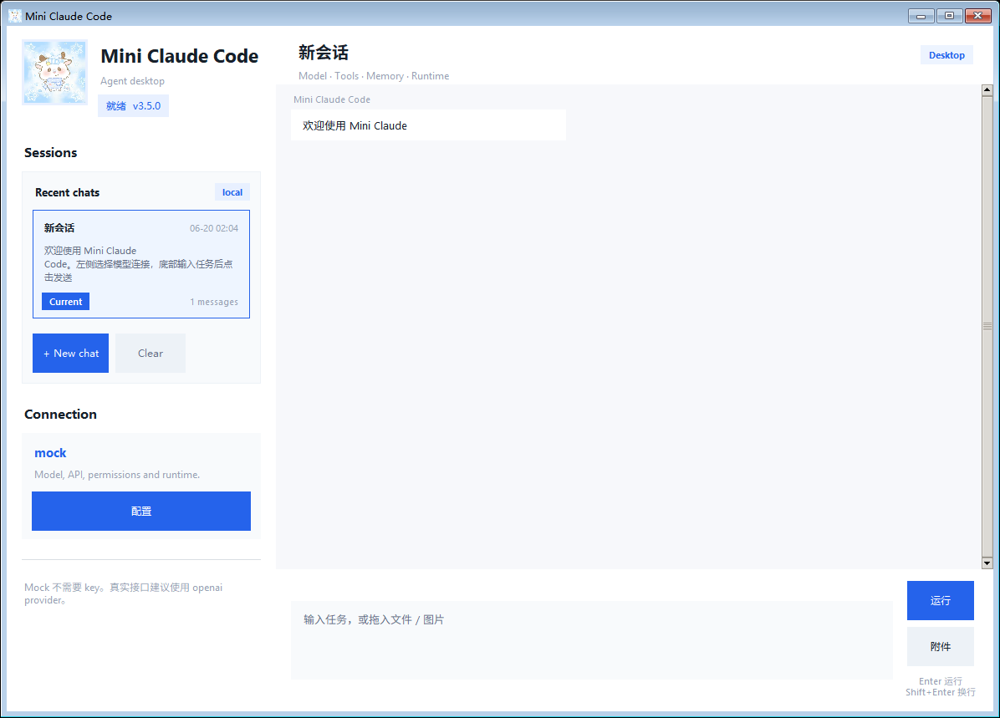

# Mini Claude Code

Mini Claude Code is a teaching and research-oriented local coding agent runtime
inspired by Claude Code. It explores how a coding agent can move beyond a basic
model-tool loop by adding workspace tools, permission control, hook events,
context handling, staged task execution, verification gates, and deterministic
task-success evidence.

The project is intended for learning, experimentation, and engineering review.
It is not a claim of product parity with Claude Code and does not present
external benchmark scores as proof of autonomous coding performance.

For a concise project overview, see [Interview Summary](docs/interview_summary.md).



## Project Scope

This repository is an implementation study of a local coding-agent runtime. It
focuses on the engineering pieces around an LLM: tool schemas, workspace file
operations, shell execution, permission policies, hooks, task state, context
snapshots, verification, and task-success reporting.

It is not intended to claim feature parity with Claude Code or any commercial
coding agent. The repository should be read as a compact engineering prototype
that demonstrates how coding-agent reliability mechanisms can be built and
tested locally.

The main goal is to make the runtime inspectable: a reviewer should be able to
see what the agent planned, which tools it called, what it changed, what it
verified, and what evidence was recorded.

## Key Capabilities

- Agent loop with Anthropic, OpenAI, and deterministic mock providers.
- Workspace tools for listing, reading, searching, patching, writing, and
  running commands.
- Permission policies around risky operations such as workspace writes, shell
  commands, network access, Docker commands, and package managers.
- Hook events for prompt submission, tool use, permission decisions, file
  changes, session lifecycle, and context compaction.
- S20 comprehensive mode with todo state, local memory, skills, git evidence,
  context snapshots, and subagent-related tools.
- `apply_patch` support for workspace-safe unified diff edits.
- Coding Task Success Loop that requires real verification after code edits.
- Staged Task State Machine enforcing:

  ```text
  INTAKE -> EXPLORE -> LOCALIZE -> PLAN -> EDIT -> VERIFY -> REPAIR -> FINAL
  ```

- Semantic Task Success Checks that validate plan relevance, edit relevance,
  verification relevance, and verification output quality.
- Local task-success artifacts for debugging and review.
- Desktop UI and a lightweight local web frontend for demo and manual testing.

These capabilities are implemented as local runtime mechanisms. They are meant
to support study and review, not to guarantee task completion across arbitrary
software projects.

## Reliability Model

The runtime separates three different questions:

1. Did the agent follow a disciplined coding process?
2. Is the plan/edit/verification evidence relevant to the user task?
3. Did the changed code pass a real local check?

`TaskStateMachine` handles the first question by enforcing staged execution.
`mini_cc.task_success` handles the second question through deterministic
task-contract and evidence checks. `CodingLoopPolicy` handles the third
question by preventing final success after code edits until a real verification
command has run.

This design does not prove global coding ability. It makes the runtime easier
to inspect, debug, and evaluate on small reproducible local tasks.

## Quick Start

Install for local development:

```powershell
cd mini-claude-code
py -3 -m pip install --upgrade pip setuptools wheel
py -3 -m pip install -e .
```

For a lightweight demo-only setup, installing `requirements.txt` is also enough:

```powershell
py -3 -m pip install -r requirements.txt
```

Run with no API key:

```powershell
py -3 -m mini_cc --mock --workspace . "list files"
```

Run the S20 comprehensive mode with the mock provider:

```powershell
py -3 -m mini_cc --mock --s20 --permission auto --workspace . "s20 snapshot"
```

Run through the non-interactive harness-style interface:

```powershell
py -3 -m mini_cc run --mock --s20 --permission-mode bypass --workspace . --output-format json --prompt "s20 snapshot"
```

Run tests:

```powershell
py -3 -m unittest discover
```

If multiple Python versions are installed, select a known-good Python manually:

```powershell
$py='C:\Path\To\python.exe'
$env:TMP="$PWD\.tmp-tests"
$env:TEMP=$env:TMP
$env:TMPDIR=$env:TMP
$env:PYTHONDONTWRITEBYTECODE='1'
& $py -m unittest discover
```

## Coding Task Success Loop

Coding Task Success Loop moves code tasks from "the agent can call tools" to
"the agent must verify after editing." The runtime tracks file edits, blocks a
final answer until a real test/check command runs, asks the model to repair
failed verification, reruns verification, and writes a task-success artifact.

Run with S20:

```powershell
py -3 -m mini_cc --s20 --coding-loop --permission auto --workspace . "fix the failing test"
```

Harness-style run with an explicit test command:

```powershell
py -3 -m mini_cc run --s20 --coding-loop --test-command "python -m unittest discover" --permission-mode bypass --workspace . --output-format json --prompt "fix the bug"
```

Key rules:

- `apply_patch` applies unified diffs and is safer than exact-string
  replacement for larger code edits.
- Only test/check commands run through `run_shell` count as verification.
- `git_diff` is useful diff evidence, but it is not pass/fail evidence.
- `git_status` is workspace evidence, but it is not pass/fail evidence.
- `context_snapshot` is context evidence, but it is not pass/fail evidence.
- The latest task outcome is written to `.mini_cc/task-success/last-run.json`.

## Staged Task State

`TaskStateMachine` enforces process rules in code, not only in the system
prompt:

- writes are blocked before exploration and planning;
- existing files must be read before they can be edited;
- edits are limited to `planned_files` unless the task explicitly requires a
  new file;
- after edits, only real test/lint/typecheck/build commands through `run_shell`
  move the task toward `FINAL`;
- failed verification moves the task to `REPAIR` until the repair limit is
  reached.

This is separate from `CodingLoopPolicy`: the state machine controls the task
process, while `CodingLoopPolicy` remains the final task-success gate.

## Semantic Task Success Checks

`mini_cc.task_success` adds a deterministic semantic evidence layer on top of
the staged process gate. It does not call another model. Instead, it extracts a
small `TaskContract` from the user prompt and checks whether the plan, edits,
and verification evidence are relevant to that contract.

The semantic layer checks:

- explicit paths, symbols, requested operations, and user constraints such as
  "only modify this file" or "do not modify tests";
- whether `planned_files` are grounded in prompt paths, explored candidates, or
  files that were actually read;
- whether edits stay inside `planned_files` and match the task type;
- whether the verification command is a real test/lint/typecheck/build command
  and relevant to the modified files;
- whether successful verification output is meaningful, for example rejecting
  `pytest` runs that report `collected 0 items` or `no tests ran`.

The task-success artifact includes `task_contract`, `process_checks`,
`semantic_checks`, `semantic_warnings`, and `semantic_blockers`.

## Providers

### Mock Provider

Use `--mock` for deterministic local runs without an API key:

```powershell
py -3 -m mini_cc --mock --workspace . "list files"
```

### Anthropic API Provider

Install dependencies and create `.env` from `.env.example`:

```powershell
py -3 -m venv .venv
.\.venv\Scripts\python -m pip install -r requirements.txt
```

Set:

```text
ANTHROPIC_API_KEY=your_key
CLAUDE_MODEL=claude-sonnet-4-6
```

Run:

```powershell
.\.venv\Scripts\python -m mini_cc --s20 --workspace . "summarize this project"
```

### OpenAI API Provider

Use an OpenAI-compatible API key by setting `OPENAI_API_KEY` and selecting the
OpenAI provider:

```powershell
$env:OPENAI_API_KEY = "your_key"
py -3 -m mini_cc run --provider openai --model gpt-5 --s20 --permission-mode bypass --workspace . --output-format json --prompt "list files"
```

## Core Modes

- `--permission ask`: ask before write tools and shell commands.
- `--permission read-only`: block write tools and shell commands.
- `--permission auto`: allow write tools and shell commands automatically.
- `--mock`: use a deterministic local provider.
- `--s20`: enable the comprehensive teaching toolset.
- `--coding-loop`: enable verification gating for code edits.
- `--test-command TEXT`: provide the verification command to prefer.
- `run --prompt ... --output-format json`: non-interactive harness entrypoint.

Diagnose merged project configuration:

```powershell
py -3 -m mini_cc --workspace . --diagnose-config
```

## Local Development Readiness

The repository includes several pieces that make it easier to review and run
locally:

- `pyproject.toml` for editable installation and console entrypoints.
- GitHub Actions CI for Python 3.10, 3.11, and 3.12.
- Windows health check script: `scripts\health_check.ps1`.
- Native one-click launcher: `scripts\start_desktop.bat`.
- Local secrets and runtime state ignored through `.gitignore`.
- Deterministic mock mode for demos without API keys.
- Unit tests for tools, permissions, hooks, workflow verification, staged task
  state, and semantic task-success checks.

Run a local health check:

```powershell
powershell -ExecutionPolicy Bypass -File scripts\health_check.ps1
```

Run the full health check including unit tests:

```powershell
powershell -ExecutionPolicy Bypass -File scripts\health_check.ps1 -Full
```

## Local UI

Start the native Windows desktop app:

```powershell
.\scripts\start_desktop.ps1
```

For one-click Windows startup, double-click:

```text
scripts\start_desktop.bat
```

The script auto-detects `py`, `pythonw`, or `python` and launches the Tkinter
desktop app. API keys are entered manually in the settings dialog and are stored
only in local ignored files under `.mini_cc/`.

Start the simple desktop-like web frontend:

```powershell
.\scripts\start_frontend.ps1
```

Then open:

```text
http://127.0.0.1:8765
```

The frontend lets you manually enter provider, API key, base URL, model,
workspace, permission mode, and prompt. API keys are passed only to the local
backend process for the current run and are not written into project files by
default.

## Hooks And Permissions

S20 mode loads project hooks from:

- `.claude/settings.json`
- `.mini_cc/settings.json`
- `.mini_cc/settings.local.json`

Hook events use the runtime catalog in `mini_cc.hooks`. The main runtime emits
events for prompt/session lifecycle, tool use, permission decisions, file
changes, context compaction, and subagent activity.

Configured hook handler types include:

- `command`: run a local command and read a JSON decision from stdout;
- `http`: POST the hook event JSON to an HTTP endpoint and read a JSON decision;
- `mcp`: call a registered MCP hook tool and read a JSON decision;
- `prompt`: render a template into `payload_updates`;
- `agent`: call a registered in-process agent hook handler.

Permission events are emitted from the permission engine itself. `ask` mode can
request confirmation, `read-only` blocks writes and shell commands, and `auto`
allows common local actions while still recording permission evidence.

## S20 Tooling

S20 mode includes:

- Planner / Executor / Verifier workflow records;
- file read, list, search, write, replace, patch, and shell tools;
- workspace path sandboxing;
- permission engine and permission ledger;
- hook runtime and hook metrics;
- todo state and structured local memory;
- local skill listing and reading;
- git status and git diff read tools;
- context snapshot support for long tasks;
- subagent and MCP-related runtime experiments.

## Task-Success Smoke Eval

Run:

```powershell
python -m mini_cc.evals.task_success
```

The eval creates a few tiny broken Python projects, applies deterministic
patches with `apply_patch`, runs `python -m unittest discover`, and writes:

```text
.mini_cc/task-success-eval/task-success-eval.json
```

This is a small local smoke validation. It is not an external benchmark score.

## Documentation

- [Coding Reliability Loop](docs/coding_reliability_loop.md)
- [Runtime Architecture](docs/architecture.md)
- [Runtime Modularization Notes](docs/runtime-modularization-change.md)
- [Interview Summary](docs/interview_summary.md)

Additional notes, localized materials, and historical review documents may
exist under `docs/` and project-specific markdown files. The main README keeps
the public project pitch focused on the English engineering summary above.

## References

- shareAI-lab/learn-claude-code: https://github.com/shareAI-lab/learn-claude-code
- Anthropic Agent Loop docs: https://code.claude.com/docs/en/agent-sdk/agent-loop
